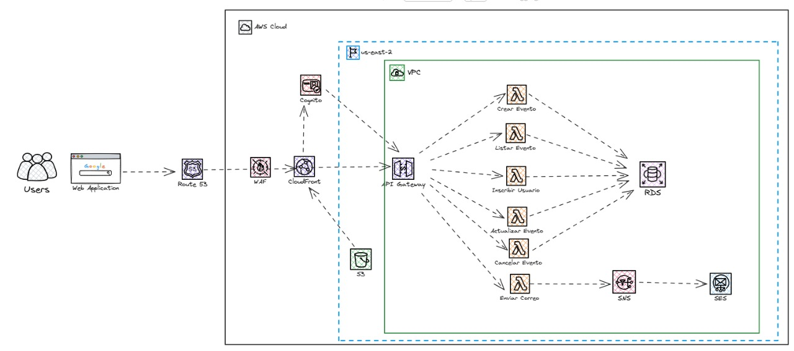

## IaC_Proyecto_Final

### Plataforma de Gestion de conferencias (AWS + Terraform)
#### Este proyecto implementa una infraestructura automatizada en AWS para una empresa que organiza conferencias de manera presencial y virtual. El objetivo es optimizar la gestion de eventos: desde la creación de eventos y el registro de participantes, hasta envio de notificaciones por correo electronico



### Comandos para Ejecurtar Terraform
##### Clonar Repositorio:  
``` 
git clone https://github.com/johnstevnn/IaC_Proyecto_Final.git
```
##### Inicializar Terraform: 
``` 
terraform init
```

##### Verificar los recursos a crear: 
```
terraform plan
```
##### Crear la infraestructura:
```
terraform apply
```